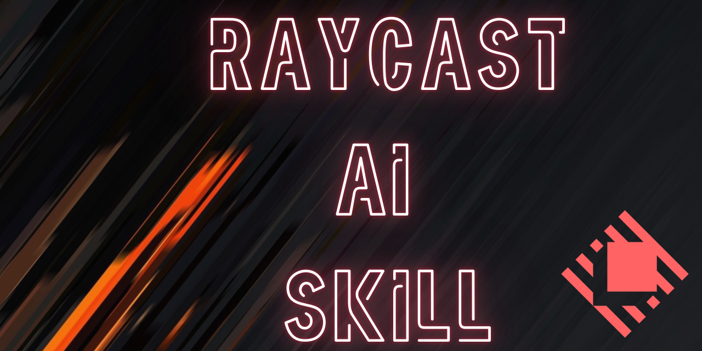

# 🔍✨ Raycast Agentic Skill



> An Agentic Skill for Raycast — helping your AI coding assistants with best practices and workflows for developing, modifying, and troubleshooting Raycast extensions (React/Node).

[](https://opensource.org/licenses/Apache-2.0)
[](https://claude.ai)
[](https://github.com/google-gemini/gemini-cli)
[](https://github.com/openai/codex)
[](https://cursor.sh)
[](https://github.com/google-deepmind)
[](https://github.com/anthropics/skills)
[](CONTRIBUTING.md)

---

## ✨ Skill Overview

Equips AI agents with crucial patterns and preferences for developing within the Raycast ecosystem:

- 🏗️ **Scaffolding & Setup** — Best practices for duplicating or creating extensions, managing `package.json`, and local dev.
- 🎨 **General UI & UX** — Standards for form inputs, auto-closing on success with `popToRoot`, and handling icon updates.
- 💾 **Data Fetching & State** — Utilizing `@raycast/utils` and `useCachedPromise` for dynamic UI elements.
- ⚙️ **Automation & Local Execution** — Executing AppleScript/Keyboard Maestro scripts via `child_process.exec` and managing the Clipboard natively.
- 🔐 **Preferences & Authentication** — Managing required secrets and properly guiding users to configure API tokens.

---

## 📋 Prerequisites

- **Raycast** installed and running.
- **Node.js** and **npm** installed.
- **Raycast API** — initialized for extension development (`npx @raycast/api@latest`).
- An AI coding assistant that supports the Agent Skills standard (see platforms below).

---

## 🚀 Installation & Integration

This skill collection follows the [Agent Skills open standard](https://github.com/anthropics/skills) and works across all major AI coding platforms.

### Quick Reference Table

| **Platform**           | **Type** | **Installation Path**                | **Invocation**                      |
| ---------------------- | -------- | ------------------------------------ | ----------------------------------- |
| **Google Antigravity** | IDE      | `.agent/skills/raycast/`             | Automatically invoked when relevant |
| **Claude Code**        | CLI      | `~/.claude/skills/raycast/`          | `Use the Raycast skill...`          |
| **Gemini CLI**         | CLI      | `~/.gemini/skills/raycast/`          | Automatically invoked when relevant |
| **OpenCode**           | IDE      | `~/.config/opencode/skills/raycast/` | `skill({ name: "raycast" })`        |
| **Cursor IDE**         | IDE      | `.cursor/skills/raycast/`            | Mentioned in chat with `@raycast`   |
| **OpenAI Codex**       | CLI      | `~/.codex/skills/raycast/`           | Automatically invoked when relevant |

### Installation

#### **Option 1: Clone from GitHub** (Recommended)

```bash
# For Google Antigravity (project skills — place in your project's .agent folder)
git clone https://github.com/adriangrantdotorg/Raycast-SKILL.git .agent/skills

# For Claude Code (global skills)
git clone https://github.com/adriangrantdotorg/Raycast-SKILL.git ~/.claude/skills/raycast

# For Gemini CLI (global skills)
git clone https://github.com/adriangrantdotorg/Raycast-SKILL.git ~/.gemini/skills/raycast
```

#### **Option 2: Manual Installation**

1. Download the latest release.
2. Extract and copy the desired skill folder(s) to your platform's skills directory.
3. Ensure each skill has a `SKILL.md` file at its root.
4. If needed, restart your AI assistant or reload the workspace.

---

## 💡 Usage Example

Once installed, your AI agent will automatically apply best practices when working with Raycast. Here’s an example prompt to try:

### Automation & Local Scripts

```
"Create a command that runs my specific Keyboard Maestro macro."
```

The agent will:

- Use Node's `child_process.exec` to run `osascript`.
- Structure the script execution safely: `exec('osascript -e \'tell application "Keyboard Maestro Engine" to do script "MACRO_ID"\'')`.
- Handle clipboard operations using the native `@raycast/api` Clipboard utilities.

---

## 🤝 Contributing

Contributions are welcome! Whether you're adding new skills, refining existing patterns, or improving documentation — your help makes this toolkit better for the whole Raycast community 🙌🏾

**Quick Start for Contributors:**

```bash
# Fork and clone the repository
git clone https://github.com/adriangrantdotorg/Raycast-SKILL.git
cd Raycast-SKILL

# Create a feature branch
git checkout -b feature/your-skill-or-fix

# Make your changes and test them with your AI agent

# Commit and push
git commit -m "Add: description of your changes"
git push origin feature/your-skill-or-fix

# Open a Pull Request on GitHub
```

---

## 📚 Additional Resources

- **[Raycast API Docs](https://developers.raycast.com/)** — Official extension API reference
- **[Raycast Utils](https://developers.raycast.com/utilities/)** — Helper utilities for React hooks and more
- **[Agent Skills Specification](https://github.com/anthropics/skills)** — Open standard documentation
- **[Raycast Store](https://www.raycast.com/store)** — Discover what others have built
- **[Raycast Community](https://raycast.com/community)** — Community support and discussion

---

## 🐛 Issues & Support

Encountered a problem or have a suggestion?

- **Bug Reports**: [Open an issue](https://github.com/adriangrantdotorg/Raycast-SKILL/issues/new?template=bug_report.md)
- **Feature Requests**: [Request a feature](https://github.com/adriangrantdotorg/Raycast-SKILL/issues/new?template=feature_request.md)

---

<div align="center">
<sub>Built with ❤️ for the Raycast community & AI-powered workflows 🤖</sub>
</div>
